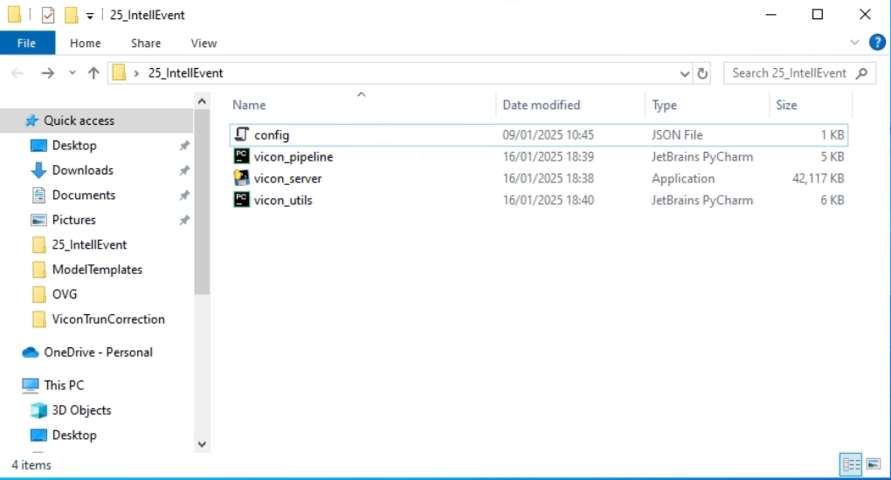
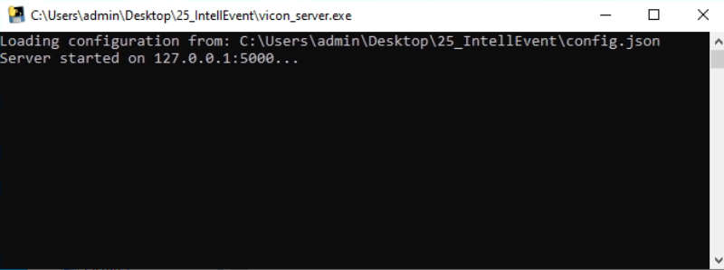
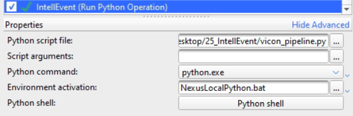

# IntellEvent

## Introduction
*IntellEvent* is a robust deep learning-based framework for gait event detection across various pathologies for 3D motion capture data. By leveraging deep learning models, *IntellEvent* accurately detects gait events (initial contact (IC) and foot off (FO)) in patients with different clinical conditions, including malrotation deformities and/or frontal malalignments of the lower extremities, club foot, cerebral palsy, drop foot, and healthy participants. *IntellEvent* ensures reliable and precise gait events even in complex pathological cases (IC: < 5.5 ms @150 Hz, FO: < 11.4 ms @150 Hz ). For more detailed information, refer to the original paper: [Robust deep learning-based gait event detection across various pathologies](https://journals.plos.org/plosone/article?id=10.1371/journal.pone.0288555).

## Dataset
The dataset used for *IntellEvent* consists of a comprehensive retrospective clinical 3D gait analysis (3DGA) dataset:

- **Total Subjects**: 1211 patients and 61 healthy controls

### Categories
- **Malrotation deformities of the lower limbs (MD)**: 730 subjects
- **Club foot (CF)**: 120 subjects
- **Cerebral palsy (CP)**: 344 subjects
- **Cerebral palsy with only drop foot characteristics (DF)**: 17 subjects
- **Healthy controls (HC)**: 61 subjects

# Requirements
**This framework has been tested with Vicon Nexus version 2.14 and higher. No installation required!** <br>
If you would like to use Vicon Nexus 2.12.1, please get in touch, we will find a solution. 

# Vicon Nexus Usage

1) Download the `25_IntellEvent.zip` folder from the release **[here](https://github.com/fhstp/IntellEvent/releases/download/v2.0/25_IntellEvent.zip)**.
2) Extract the files to a folder of your choice. **Note:** All files must be loacated in the same folder. <br><br>
    <br><br>
3) Start the `vicon_server.exe`. <br><br>
    <br><br>
4) Create a new `Run Python Operation` in a Vicon Nexus pipeline from the operation `Data Processing` tab. Add the `vicon_pipeline.py` to the `Python script file` path. <br> <br>
    <br><br>
5) Run the pipeline and save time!

# Future Developments
- **Integrating Further Movement Tasks**:
  - Turning
  - Running
- **Ensuring Robustness for Different Laboratory Settings**:
  - Standardize data preprocessing from multiple laboratory sources
  - Utilize data from different labs
- **Integrating Fine-Tuning Pipeline**
- **Implement a Pipeline for Continuous Refinement and Optimization**


# Current Results
The current model achieves the following Mean Absolute Errors (MAE) in milliseconds for different pathologies:

| Category  | MD   | CF   | DF   | CP   | HC   |
|-----------|-------|-------|-------|-------|-------|
| **IC MAE [ms]** | 2.7   | 3.5   | 5.4   | 4.9   | 2.5   |
| **FO MAE [ms]** | 7.9   | 8.7   | 9.9   | 11.3   | 8.3   |

# Citation
If you are using *IntellEvent* in your research we would appreciate a citation. 
> [1] B. Dumphart et al., ‘Robust deep learning-based gait event detection across various pathologies’, *PLOS ONE*, vol. 18, no. 8, p. e0288555, Aug. 2023, doi: 10.1371/journal.pone.0288555.
```
@article{dumphartRobustDeepLearningbased2023,
  title = {Robust Deep Learning-Based Gait Event Detection across Various Pathologies},
  author = {Dumphart, Bernhard and Slijepcevic, Djordje and Zeppelzauer, Matthias and Kranzl, Andreas and Unglaube, Fabian and Baca, Arnold and Horsak, Brian},
  year = {2023},
  journal = {PLOS ONE},
  volume = {18},
  number = {8},
  pages = {e0288555},
  publisher = {{Public Library of Science}},
  issn = {1932-6203},
  doi = {10.1371/journal.pone.0288555},
  keywords = {Algorithms,Cerebral palsy,Feet,Gait analysis,Machine learning algorithms,Neural networks,Recurrent neural networks,Toes}
}
```


# Contact
If you need any help, have further ideas, or have questions regarding *IntellEvent* please feel free to contact me!
```
bernhard.dumphart@fhstp.ac.at
```
```
djordje.slijepcevic@fhstp.ac.at
```
```
brian.horsak@fhstp.ac.at
```

# License
Creative Commons Attribution 4.0 International Public License
